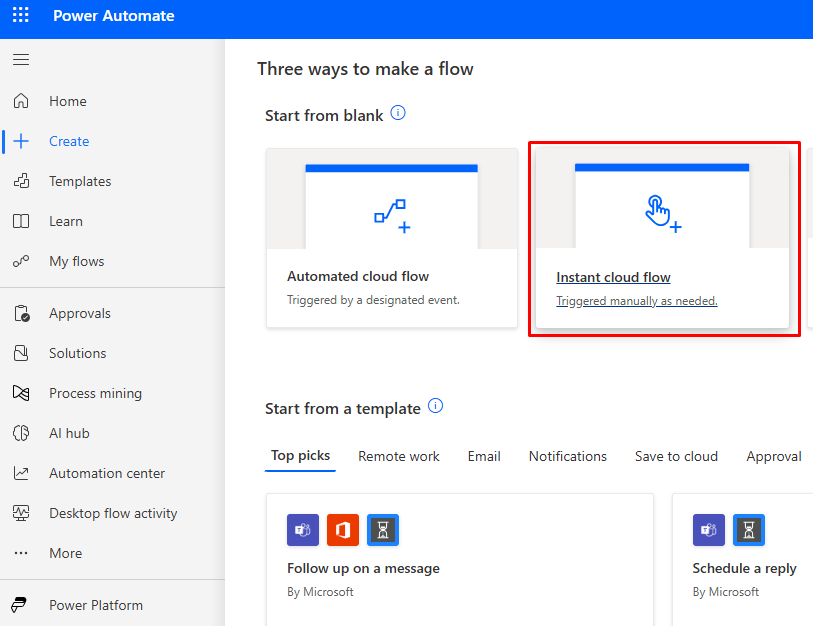
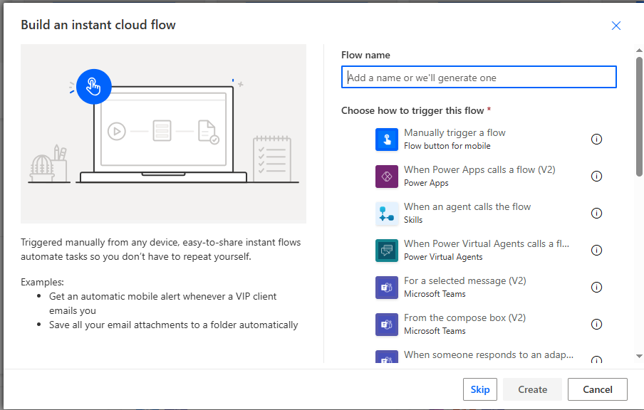
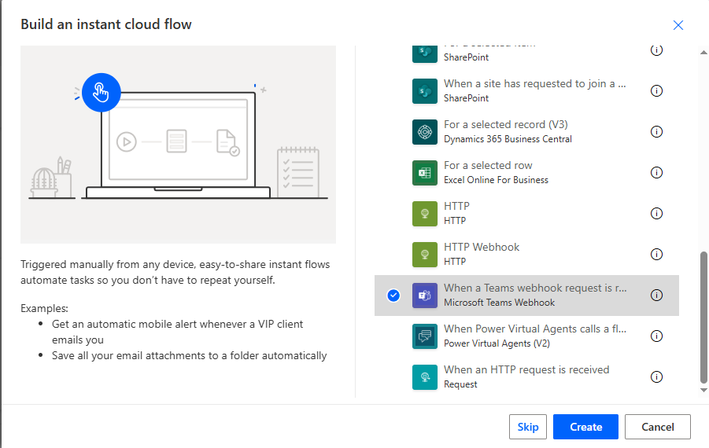
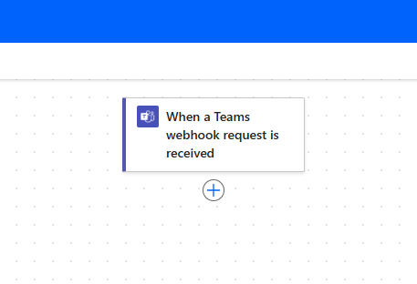
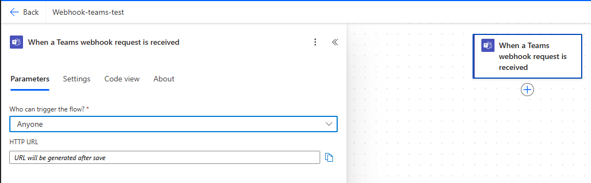
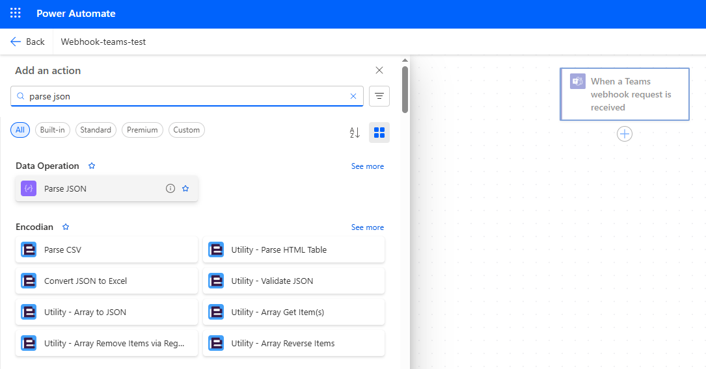
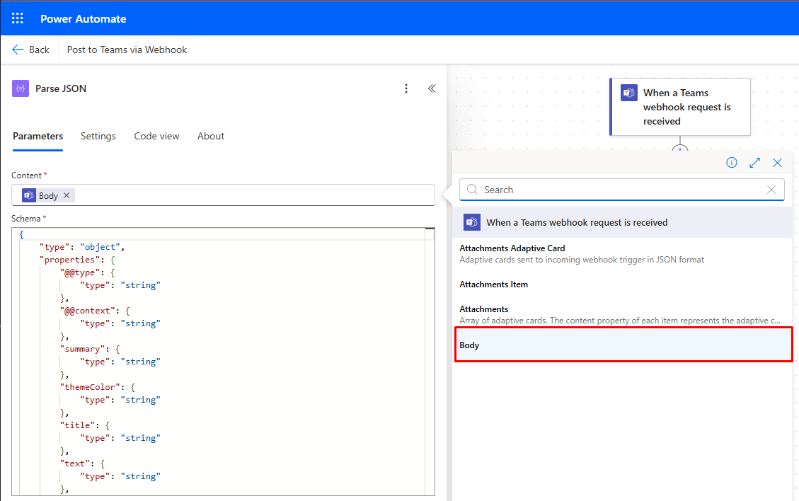

# Due Notifications Webhook for Redmine

!Redmine 5.x/6.x

## Description

**due_notifications_webhook** is a Redmine plugin that automatically sends notifications to Microsoft Teams (via Incoming Webhook) about issues that are approaching their due date or are overdue.

- **Supported Redmine versions:** 5.x and 6.x
- **Daily notifications** about upcoming or overdue tasks
- **Separate templates** for "due soon" and "overdue" messages
- **Configurable:** set send time, webhook URL, days before/after due date, and manual trigger via settings page

---

## Installation

1. Clone the plugin into your Redmine `plugins/` directory:
    ```sh
    cd /path/to/redmine/plugins
    git clone <REPO_URL> due_notifications_webhook
    ```

2. Restart your Redmine server.

3. Navigate to **Administration → Plugins → Due Notifications Webhook** to configure settings.

---

## Plugin Settings

On the plugin settings page, you can configure:

- **Message send time** — time of day to send notifications (format: `HH:MM`, e.g., `09:00`)
- **Microsoft Teams Webhook URL** — your Teams channel webhook URL
- **Days before due date to notify** — how many days before the due date to send a warning
- **Days after due date to notify** — how many days after the due date to send reminders
- **Send message now** — a button to send all notifications immediately (manual trigger)

---

## Scheduled Notifications (via Cron)

> **To ensure notifications are sent automatically at the desired time, schedule the rake task with cron.**

### **1. Add to crontab:**

#### If running Redmine in Docker (replace `redmine-6` with your container name):

```sh
*/5 * * * * docker exec -i redmine-6 bash -c "cd /usr/src/redmine && PATH=/usr/local/bundle/bin:/usr/local/bin:/usr/bin:/bin && bundle exec rake due_notifications_webhook:send_notifications >> /usr/src/redmine/log/due_notifications_webhook.log 2>&1"
```

#### If running Redmine directly (no Docker):

```sh
*/5 * * * * cd /path/to/redmine && PATH=/usr/local/bundle/bin:/usr/local/bin:/usr/bin:/bin && bundle exec rake due_notifications_webhook:send_notifications >> log/due_notifications_webhook.log 2>&1
```

#### Cron runs the task every 5 minutes.
#### The plugin itself checks the time and sends notifications only at the time specified in the settings (e.g., 09:00).
#### All output is logged to log/due_notifications_webhook.log

---

# How to configure Webhooks for MS Teams
This guide explains how to configure Microsoft Power Automate (Flow) to receive external webhook data and post it as a message in a Microsoft Teams channel using the MessageCard format.

---

## ✅ Prerequisites

- A valid Microsoft 365 account (Business package) with access to **Power Automate** and **Microsoft Teams**.
- Permission to create flows in Power Automate.
- Permission to post messages in the target Microsoft Teams channel.
- Access to create **Incoming Webhooks** in MS Teams.

---

## 1. Register on Microsoft Power Automate

1. Go to [https://powerautomate.microsoft.com](https://powerautomate.microsoft.com).
2. Click **Sign In** (or **Start free** if you don’t have an account).
3. Sign in with your Microsoft 365 credentials or create a new account.
4. Once logged in, you will be redirected to the Power Automate Dashboard.

---

## 2. Create an Instant Cloud Flow to Handle Webhook and Post to MS Teams

### Step-by-step Instructions:

1. In Power Automate Dashboard, click **Create** > **Instant cloud flow**.




2. Name the flow, e.g., `PostWebhookToTeams`.



3. Choose **"When an HTTP request is received"** as the trigger.



4. Click **Create**.

---

### 2.1 Configure the HTTP Trigger

1. After flow is created, click on the HTTP trigger block.



2. In Parametrs set "Anyone" (Who can trigger the flow?)



### 2.2 Configure the Parse JSON
1. Click on "+" after the HTTP trigger block and add block "Parse JSON"



2. To Content field add "Body" variable through clicking on "Lightning" icon on the right of field



3. Click **Use sample payload to generate schema**.

4. Paste the following example JSON:
```json
{
    "@type": "MessageCard",
    "@context": "http://schema.org/extensions",
    "summary": "⚠️ Overdue Issue!!!",
    "themeColor": "0078D7",
    "title": "⚠️ Overdue Issue!!!",
    "text": "<b>⚠️ Overdue Issue!!!</b>\n<hr/>\n<b>🔖 Subject:</b> <a href=\"http://localhost:3000/issues/11\">🔗 #11 - dfgdsf</a><br/>\n<b>📁 Project:</b> test01<br/>\n<b>🧑 Assignee:</b> Roman Kharcenko<br/>\n<b>📅 Due date:</b> 2025-05-22<br/>\n<hr/>\n<i>The issue is already overdue <b>** 3 days **!</b> It is urgently necessary to perform!!!</i>\n"
}
```


5. Click Done to auto-generate the schema.

### 2.3 Add an Action: Post to Microsoft Teams
1. Click + New Step.
2. Search for Microsoft Teams.
3. Select "Post a message in a chat or channel".
4. Choose:
    - Post as: User (or Flow bot if preferred)
    - Post in: Channel
    - Team: Select your target Team
    - Channel: Select the target Channel
    - Message: add variable "Body text" for post message
    - connect to MS Teams with user, that must post messages 

    

    

    

### 2.4 Save and Get the Webhook URL
1. Click Save at the top.
2. Copy the HTTP POST URL that appears in the trigger section.


3. This is your webhook endpoint. You can now send POST requests to it with your JSON payload.

### 2.5 Put the Webhook URL in to Plugin settings
1.

---

## Structure of the plugin

```sh
redmine_due_notifications_webhook/
├── app/
│   └── controllers/
│        └── due_notifications_webhook_controller.rb
│   └── views/
│        └── settings/
│             └── _settings.html.erb
│
├── config/
│   └── locales/
│        ├── en.yml
│        ├── ja.yml
│        └── uk.yml
│   └── routes.rb
│
├── lib/
│   └── due_notifications_webhook/
│        ├── message_templates.rb
│        └── teams_notifier.rb
│   └── tasks/
│        └── due_notifications_webhook.rake
│
├── spec/
│   └── lib/
│        └── teams_notifier_spec.rb
│   └── rails_helper.rb
│
├── test/
│   └── unit/
│       ├── send_notifications_task_test.rb
│       └── teams_notifier_test.rb
│
├── Gemfile.local
├── .rspec
├── init.rb
└── README.md
```
> **Running the test**

```sh
bin/rspec plugins/due_notifications_webhook/spec/lib/teams_notifier_spec.rb
```